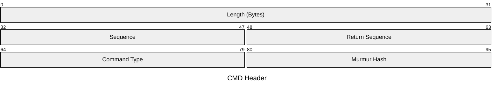

# Network Message Format for Shard/Loadbalancer Communication

All messages follow the same length encoded format and most are big endian coded.

## Message Header

| Field           | Description                                                                         |
|-----------------|-------------------------------------------------------------------------------------|
| Length          | Message Length in Bytes                                                             |
| Sequence        | Incremental Sequence Number of the Message Sender                                   |
| Return Sequence | Set to the Sequence of the Request Package (if it exists)                           |
| Command Type    | Command Type of the Message                                                         |
| Murmur Hash     | Murmur v2 Hash over the entire Message (header seems to be hashed as little endian) |

## Command Types

- `SCMD_*` -> Server to Client Message
- `CCMD_*` -> Client to Server Message
- `CSCMD_*` -> Client to Server to Client Roundtrip Message

| Idx | Name                             | Idx | Name                              |
|----:|----------------------------------|----:|-----------------------------------|
|   0 | `SCMD_ASSIGNED_SHARD`            |  20 | `SCMD_QUEST_NOTIFICATION`         |
|   1 | `SCMD_LB_QUEUE_INFO`             |  21 | `SCMD_LEAGUE_NOTIFICATION`        |
|   2 | `SCMD_LB_CVARS`                  |  22 | `SCMD_VESSEL_NOTIFICATION`        |
|   3 | `SCMD_AUTH_REQ`                  |  23 | `SCMD_LOBBY_NOTIFICATION`         |
|   4 | `CCMD_AUTH_REQUEST`              |  24 | `SCMD_KEEP_ALIVE`                 |
|   5 | `SCMD_AUTH_ACK`                  |  25 | `SCMD_BAN_INFO`                   |
|   6 | `SCMD_STEAM_NOT_ATTACHED`        |  26 | `SCMD_WELCOME_MSG`                |
|   7 | `SCMD_ARC_NOT_ATTACHED`          |  27 | `SCMD_DOCK_SPACE_STATION`         |
|   8 | `CCMD_STORE`                     |  28 | `SCMD_FREE_SPACE_DEBRIEFING`      |
|   9 | `SCMD_STORE`                     |  29 | `SCMD_NEW_MOTD`                   |
|  10 | `SCMD_STORE_SPOILED`             |  30 | `SCMD_TOURNAMENT_TEAMS_INFO`      |
|  11 | `SCMD_CONNECT_DEDICATED_SERVER`  |  31 | `SCMD_BRAWL_SCHEDULE`             |
|  12 | `SCMD_GAME_ENDED`                |  32 | `SCMD_REWARD_SCHEDULE`            |
|  13 | `CSCMD_ASYNC_REQ`                |  33 | `SCMD_PVE_SCHEDULE`               |
|  14 | `SCMD_NOTIFICATION`              |  34 | `SCMD_LEAGUE_FORBIDDEN_EQUIPMENT` |
|  15 | `SCMD_SQUAD_NOTIFICATION`        |  35 | `SCMD_BATTLE_PASS_ACTIVATION`     |
|  16 | `SCMD_SOCIAL_NOTIFICATION`       |  36 | `SCMD_ZONES_WITH_DISABLED_QUESTS` |
|  17 | `SCMD_TEACH_NOTIFICATION`        |  37 | `SCMD_ADVENTURE_NOTIFICATION`     |
|  18 | `SCMD_CLAN_NOTIFICATION`         |  38 | `SCMD_REPLACE_CHAT_MSG`           |
|  19 | `SCMD_USER_PROFILE_NOTIFICATION` |     |                                   |

## Sub Types

### AC Types

These types are used within `CSCMD_ASYNC_REQ` messages.

### SN Types

These types are used within `SCMD_NOTIFICATION` messages, the body is always a Variant map.

## Variant Map Format

- `u32` Amount of entries
- `bit` Whether the Variant map is using Integer or C-String Keys
- `[variant]` List of variants

### `variant`

key `Either[int, string]` : type `u8` : value

| `u8` | type |
|------|------|
| 0x00 | nil |
| 0x01 | int32|
| 0x02 | uint64 |
| 0x03 | uint64 (another?) |
| 0x04 | float32 |
| 0x05 | C-String |
| 0x06 | Variant Map |
| 0x07 | unkwn |
| 0x08 | boolean |
